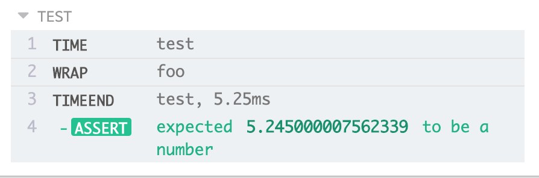
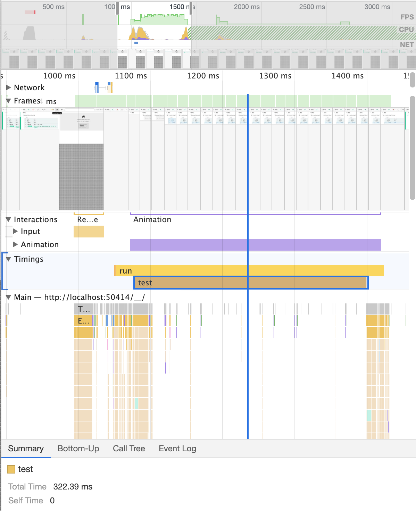

## cypress-time
Record timings in Cypress

## Why?
Sometimes you want to record how long a series of tasks/actions take. When developing, you might use browser-based time spans to give you feedback. This Cypress plugin will give you a nice way to do timings right in your test! This library uses the [User Timings API](https://developer.mozilla.org/en-US/docs/Web/API/User_Timing_API), so the time span will show up if you run a performance profile while the test is active (can only be done using `cypress open` which is dev mode).

## Installation
To install the module:
```
npm install cypress-time --save-dev
```

To get the plugin working with Cypress:
```js
// cypress/support/index.js or cypress/support/index.ts
import 'cypress-time'
```

## Use
In your spec files, `cy.time(label)` will start a time span while `cy.timeEnd(label)` will end a time span. `cy.timeEnd` will return a [PerformanceEntry](https://developer.mozilla.org/en-US/docs/Web/API/PerformanceEntry).

```js
// start the 'test' time span
cy.time('test')

cy.contains('button', 'Submit').click()

// wait until submit is complete - assume a backend is involved
cy.get('Loading').should('not.exist')

// ends the 'test' time span, printing the duration
cy.timeEnd('test')
```

If you want to do something with the time output, the [PerformanceEntry](https://developer.mozilla.org/en-US/docs/Web/API/PerformanceEntry) is returned. You can save this to a file, send it off to a service, or whatever you'd like. `startTime` and `duration` may be of the most interest.

```js
cy.time('test')

// do something

cy.timeEnd('test').then(entry => {
  console.log(entry.startTime) // start in ms elapsed since page loaded
  console.log(entry.duration) // duration between `time` and `timeEnd`
})
```

**Here's a screenshot of what the command log will look like:**


**Here's a screenshot of the Performance tools with the 'test' time span:**


## Typescript support
This plugin comes with its own type definitions. If you're using Typescript already and your support index file is a Typescript file and your tsconfig.json is configured to include *.ts files in the support directory, nothing more needs to be done. If you don't have your project set up this way, add the following to your tsconfig (ideally in `cypress/tsconfig.json`):

```json
{
  "types": ["cypress", "cypress-time"]
}
```
